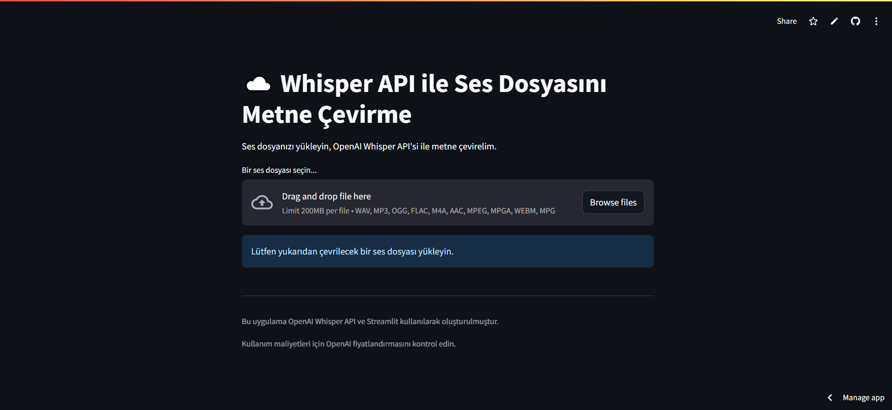

# Ses Dosyasını Metne Çevirme (Whisper API & Streamlit)

[](https://speechtotext-whisper.streamlit.app/) <!-- DEPLOY EDİNCE BU LİNKİ GÜNCELLEYİN -->

Bu proje, kullanıcıların ses dosyalarını (MP3, WAV, M4A vb.) yükleyerek OpenAI'nin güçlü Whisper API'si aracılığıyla metne dönüştürmelerine olanak tanıyan basit bir web uygulamasıdır. Uygulama arayüzü Python'un Streamlit kütüphanesi ile oluşturulmuş ve Streamlit Community Cloud üzerinde ücretsiz olarak yayınlanmıştır (veya yayınlanabilir).

## 🚀 Özellikler

*   **Kolay Dosya Yükleme:** Çeşitli ses formatlarını destekleyen bir dosya yükleme arayüzü.
*   **Ses Önizleme:** Yüklenen ses dosyasını doğrudan tarayıcıda dinleme imkanı.
*   **Yüksek Doğruluklu Transkripsiyon:** Arka planda OpenAI Whisper API (`whisper-1` modeli) kullanarak güvenilir metin çevirisi.
*   **Basit Arayüz:** Streamlit ile oluşturulmuş kullanıcı dostu ve anlaşılır web arayüzü.
*   **Güvenli API Anahtarı Yönetimi:** OpenAI API anahtarı, Streamlit Secrets kullanılarak güvenli bir şekilde saklanır.

## ✨ Demo

<!-- Buraya uygulamanızın çalışan bir GIF'ini veya ekran görüntüsünü ekleyebilirsiniz -->
<!-- Örnek: (screeshot2.png) -->

Uygulamayı canlı denemek için: [https://your-deployed-streamlit-app-url.streamlit.app/](https://speechtotext-whisper.streamlit.app/) <!-- DEPLOY EDİNCE BU LİNKİ GÜNCELLEYİN -->

## 🛠️ Kullanılan Teknolojiler

*   **Python:** Ana programlama dili.
*   **Streamlit:** Web arayüzünü oluşturmak ve yayınlamak için kullanılan framework.
*   **OpenAI API:** Ses tanıma işlemleri için `whisper-1` modeline erişim.
*   **Requests:** OpenAI API'sine HTTP istekleri göndermek için.
*   **ffmpeg:** (Streamlit Cloud ortamında `packages.txt` ile yüklenir) Whisper API'sinin farklı ses formatlarını işleyebilmesi için gereklidir.

## ⚙️ Kurulum ve Çalıştırma (Yerel Makinede)

Projeyi kendi bilgisayarınızda çalıştırmak için aşağıdaki adımları takip edebilirsiniz:

1.  **Depoyu Klonlayın:**
    ```bash
    git clone https://github.com/keremalagoz/speechtotext.git
    cd speechtotext
    ```

2.  **Sanal Ortam Oluşturun (Önerilir):**
    ```bash
    # Linux/macOS
    python -m venv venv
    source venv/bin/activate

    # Windows
    python -m venv venv
    .\venv\Scripts\activate
    ```

3.  **Gerekli Kütüphaneleri Yükleyin:**
    ```bash
    pip install -r requirements.txt
    ```

4.  **OpenAI API Anahtarını Ayarlayın:**
    *   Proje kök dizininde `.streamlit` adında bir klasör oluşturun.
    *   Bu klasörün içine `secrets.toml` adında bir dosya oluşturun.
    *   `secrets.toml` dosyasının içeriğini aşağıdaki gibi düzenleyin ve `sk-xxxxxxxx` kısmını kendi OpenAI API anahtarınızla değiştirin:
        ```toml
        # .streamlit/secrets.toml
        OPENAI_API_KEY = "sk-XXXXXXXXXXXXXXXXXXXXXXXXXXXXXXXXXXXXXXXX"
        ```
    *   **ÖNEMLİ:** `secrets.toml` dosyasını asla Git reponuza commit etmeyin! `.gitignore` dosyanızda `.streamlit/secrets.toml` satırının bulunduğundan emin olun.

5.  **Streamlit Uygulamasını Başlatın:**
    ```bash
    streamlit run app.py
    ```
    Uygulama varsayılan tarayıcınızda açılacaktır.

## ☁️ Streamlit Community Cloud ile Yayınlama

Bu uygulamayı ücretsiz olarak web'de yayınlamak için:

1.  Projeyi bir GitHub deposuna yükleyin (`app.py`, `requirements.txt`, `packages.txt` dosyaları dahil).
2.  [Streamlit Community Cloud](https://share.streamlit.io/)'a GitHub hesabınızla giriş yapın.
3.  "New app" butonuna tıklayın ve GitHub deponuzu, branch'inizi (genellikle `main` veya `master`) ve ana Python dosyanızın yolunu (`app.py`) seçin.
4.  **`packages.txt` Dosyası:** Deponuzda aşağıdaki içeriğe sahip bir `packages.txt` dosyası olduğundan emin olun. Bu, Streamlit Cloud'un `ffmpeg`'i yüklemesini sağlar:
    ```text
    # packages.txt
    ffmpeg
    ```
5.  **Advanced Settings -> Secrets:** Uygulamanızın Streamlit Cloud ayarlarındaki "Secrets" bölümüne gidin ve OpenAI API anahtarınızı şu formatta ekleyin:
    ```toml
    OPENAI_API_KEY = "sk-XXXXXXXXXXXXXXXXXXXXXXXXXXXXXXXXXXXXXXXX"
    ```
6.  "Deploy!" butonuna tıklayın. Uygulamanız birkaç dakika içinde yayında olacaktır.

## 🔑 Yapılandırma (API Anahtarı)

Bu uygulamanın çalışması için bir OpenAI API anahtarına ihtiyacınız vardır.
*   OpenAI hesabınızdan bir API anahtarı oluşturun: [https://platform.openai.com/api-keys](https://platform.openai.com/api-keys)
*   **Kesinlikle API anahtarınızı doğrudan koda yazmayın veya herkese açık yerlerde paylaşmayın!**
*   Yerel çalıştırma için `.streamlit/secrets.toml` dosyasına ekleyin.
*   Streamlit Cloud'da yayınlamak için uygulamanın "Secrets" bölümüne ekleyin. Kod (`st.secrets["OPENAI_API_KEY"]` kullanarak) anahtara güvenli bir şekilde erişecektir.

##  kullanım

1.  Yayınlanan Streamlit uygulamasına gidin.
2.  "Bir ses dosyası seçin..." butonuna tıklayarak bilgisayarınızdan bir ses dosyası yükleyin (örn. MP3, WAV, M4A).
3.  İsteğe bağlı olarak yüklenen sesi dinleyebilirsiniz.
4.  "OpenAI API ile Metne Çevir" (veya benzeri) butonuna tıklayın.
5.  İşlem tamamlandığında, çevrilen metin aşağıdaki metin alanında görünecektir.

## 🤝 Katkıda Bulunma

Katkılarınız memnuniyetle karşılanır! Hata bildirmek veya yeni özellikler önermek için lütfen bir "Issue" açın. Kod katkısı yapmak isterseniz, bir "Pull Request" gönderebilirsiniz.

## 📄 Lisans

Bu proje MIT Lisansı altında lisanslanmıştır. Detaylar için `LICENSE` dosyasına bakınız. (Eğer bir LICENSE dosyası eklemediyseniz, eklemeniz önerilir. MIT yaygın bir seçenektir.)

## 🙏 Teşekkürler

*   Harika API'si için [OpenAI](https://openai.com/)'a.
*   Kolay web uygulaması geliştirme ve yayınlama imkanı sunduğu için [Streamlit](https://streamlit.io/)'e.

---
